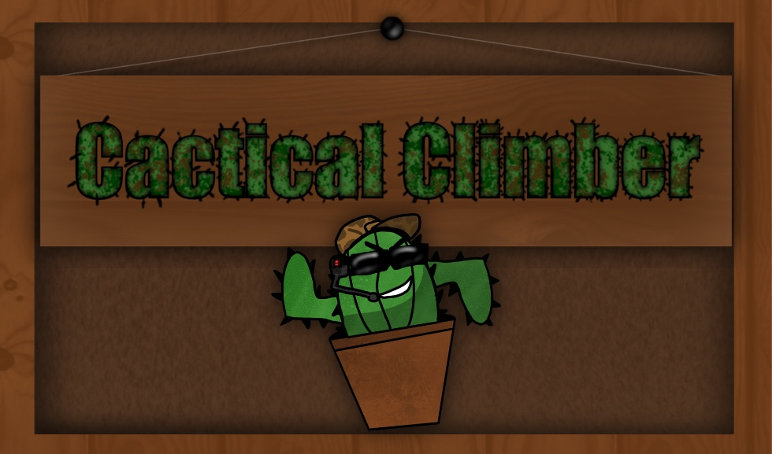

 
Cactical Climber is a VR climbing game in which you, a cactus, must use your spurs to climb over, up, and onto objects in order to reach the flower pot under the heat lamp before you freeze over!

© 2020 Pigeon Rubbish Studios   
Coding By Kyle Bolinger   
Artwork By Kyle Bolinger   
3D Modeling By Kyle Bolinger  
Music By Kyle Bolinger   
